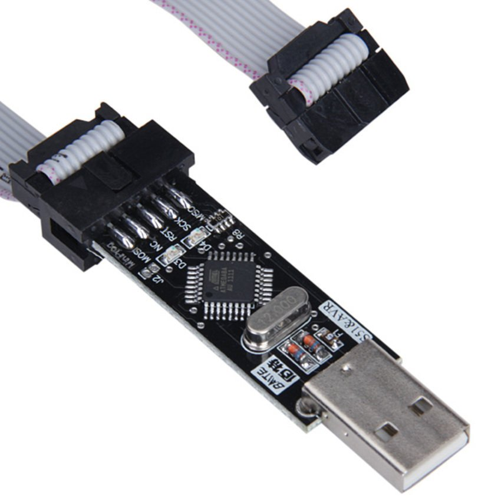
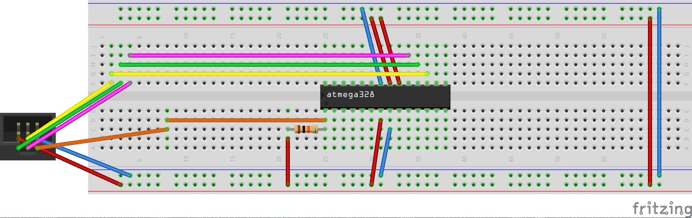
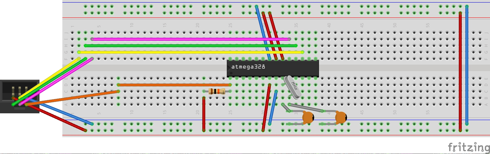
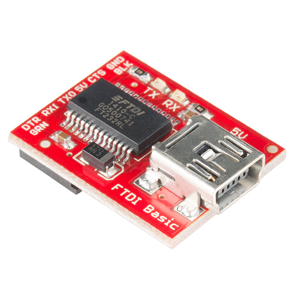

# AVR Cheat Sheet 

*The Following Cheat Sheet is built based on the ATmega328p, but other AVR microcontroller should follow similar steps.
Also note that this cheat sheet is just for reference. Therefore always refer to the original datasheet
for complete and more accurate information.*

## Table of Contents

* [Datasheet](#datasheet)
    * [ATmega328p](#atmega328p)
* [Packages](#packages)
    * [Arch linux](#arch-linux)
* [Microcontroller](#microcontroller)
    * [ATmega328p](#atmega328p-1)
* [Programmer](#programmer)
    * [Sparkfun Pocket AVR Programmer](#sparkfun-pocket-avr-programmer)
    * [USBASP USBISP AVR Programmer](#usbasp-usbisp-avr-programmer)
    * [Programmer circuit](#programmer-circuit)
* [Eclipse](#eclipse)
    * [Installation](#installation)
    * [Create a new project](#create-a-new-project)
    * [Configure project](#configure-project)
    * [Configure fuse bits](#configure-fuse-bits)
    * [Build and upload from Eclipse](#build-and-upload-from-eclipse)
* [Manually (no IDE)](#manually-no-ide)
    * [Build and upload manually](#build-and-upload-manually)
    * [Reset fuse bytes to default values manually](#reset-fuse-bytes-to-default-values-manually)
    * [Read fuse bytes manually](#read-fuse-bytes-manually)
* [Input/Output](#inputoutput)
    * [Introduction](#introduction)
    * [DDRx](#ddrx)
    * [PORTx](#portx)
    * [PINx](#pinx)
* [Fuse bits](#fuse-bits)
    * [Introduction](#introduction-1)
    * [Low fuse byte](#low-fuse-byte)
    * [High fuse byte](#high-fuse-byte)
    * [Extended fuse byte](#extended-fuse-byte)
* [Clock source](#clock-source)
    * [Introduction](#introduction-2)
    * [Why using external clock source](#why-using-external-clock-source)
    * [Clock sources](#clock-sources)
        * [Low Power Crystal Oscillator](#low-power-crystal-oscillator)
        * [Full Swing Crystal Oscillator](#full-swing-crystal-oscillator)
        * [Low Frequency Crystal Oscillator](#low-frequency-crystal-oscillator)
        * [Calibrated Internal RC Oscillator](#calibrated-internal-rc-oscillator)
        * [128kHz Internal Oscillator](#128khz-internal-oscillator)
        * [External Clock](#external-clock)
    * [Example of clock source](#example-of-clock-source)
* [External interrupts](#external-interrupts)
    * [Difference between INTx and PCINTx](#difference-between-intx-and-pcintx)
    * [Configure INTx](#configure-intx)
    * [Configure PCINTx](#configure-pcintx)
    * [Example of external interrputs](#example-of-external-interrputs)
* [Timer](#timer)
    * [Introduction](#introduction-3)
    * [Timer 0 (TC0 8-bit)](#timer-0-tc0-8-bit)
    * [Timer 1 (TC1 16-bit)](#timer-1-tc1-16-bit)
        * [TODO: To continue other registers](#todo-to-continue-other-registers)
    * [Timer 2 (TC2 8-bit)](#timer-2-tc2-8-bit)
        * [TODO: To continue other registers](#todo-to-continue-other-registers-1)
* [USART](#usart)
    * [USART Initialization](#usart-initialization)
    * [Sending Frames with 5 to 8 Data Bits](#sending-frames-with-5-to-8-data-bits)
    * [Receiving Frames with 5 to 8 Data Bits](#receiving-frames-with-5-to-8-data-bits)
    * [USART Example](#usart-example)
    * [FTDI](#ftdi)
        * [SparkFun FTDI Basic Breakout - 5V](#sparkfun-ftdi-basic-breakout---5v)
    * [FTDI connection](#ftdi-connection)
    * [Send and Recieve data to/from AVR](#send-and-recieve-data-tofrom-avr)
        * [Arch Linux](#arch-linux-1)
* [PWM](#pwm)
    * [Pins](#pins)
    * [PWM Example](#pwm-example)
* [Examples](#examples)
* [Contributing](#contributing)
* [Resources](#resources)
    * [Websites](#websites)
    * [YouTube](#youtube)

## Datasheet
### ATmega328p
PDF from <a href="http://www.atmel.com/Images/Atmel-42735-8-bit-AVR-Microcontroller-ATmega328-328P_Datasheet.pdf">Atmel</a>
  * LPT: Check the **Register Description** for your topic. For example, if you want to learn about "External Interrupts", visit the **Register Description** under the **EXINT - External Interrupts** chapter.

## Packages
### Arch linux
* avr-binutils
* avr-gcc
* avr-libc
* avrdude

## Microcontroller
### ATmega328p
```
                          ATmega328p
                          +---------+
(PCINT14/RESET)      PC6 /|1  \_/ 28|\ PC5 (ADC5/SCL/PCINT13)
(PCINT16/RXD)        PD0 /|2      27|\ PC4 (ADC4/SDA/PCINT12)
(PCINT17/TXD)        PD1 /|3      26|\ PC3 (ADC3/PCINT11)
(PCINT18/INT0)       PD2 /|4      25|\ PC2 (ADC2/PCINT10)
(PCINT19/OC2B/INT1)  PD3 /|5      24|\ PC1 (ADC1/PCINT9)
(PCINT20/XCK/T0)     PD4 /|6      23|\ PC0 (ADC0/PCINT8)
VCC                      /|7      22|\     GND
GND                      /|8      21|\     AREF
(PCINT6/XTAL1/TOSC1) PB6 /|9      20|\     AVCC
(PCINT7/XTAL2/TOSC2) PB7 /|10     19|\ PB5 (SCK/PCINT5)
(PCINT21/OC0B/T1)    PD5 /|11     18|\ PB4 (MISO/PCINT4)
(PCINT22/OC0A/AIN0)  PD6 /|12     17|\ PB3 (MOSI/OC2A/PCINT3)
(PCINT23/AIN1)       PD7 /|13     16|\ PB2 (SS/OC1B/PCINT2)
(PCINT0/CLKO/ICP1)   PB0 /|14     15|\ PB1 (OC1A/PCINT1)
                          +---------+
```

## Programmer
### Sparkfun Pocket AVR Programmer
The device was tested on Ubuntu 16.04 and Arch linux  
  

### USBASP USBISP AVR Programmer
The device was tested on Arch linux  


### Programmer circuit
Components for circuit (1) and (2):
* 1x ATmega328p
* 1x Resistor 10K ohm
* 1x AVR Programmer

Additional components for circuit (2):
* 1x Crystal oscillator 16Mhz
* 2x Capacitor 12-22pf

*Note: For details about the crystal oscillator and capacitors values, refer to the datasheet under the section "System Clock and Clock Options"*

Circuit (1): If the AVR fuse bits are configured to use the internal oscillator 
  

Circuit (2): If the AVR fuse bits are configured to use an external clock source
  

*Note: For more details about fuse bits please refer to the [Fuse bits](#fuse-bits) section*

For AVR Programming cable with 6 pins:  
  

For AVR Programming cable with 10 pins:  
  

## Eclipse
### Installation
* Install Eclipse C/C++
* Install plugin:
  * From Eclipse, go to **Help** > **Eclipse Marketplace**
  * Search for and install **AVR Eclipse Plugin**

### Create a new project
* Create a new C Project
  * Select **AVR Cross Target Application** > **Empty Project** as project type
  * Select **AVR-GCC Toolchain** in the Toolchains box
* Press **Finish**

### Configure project
* In **Project Explorer** select the AVR project
* Go to **Project** > **Properties**
* Expand **C/C++ Build** then select **Settings**
  * Check the **Generate HEX file for Flash memory**
* Expand **AVR** then select **AVRDude**
  * From the **Programmer** tab
    * Create a new programmer configuration
    * Give this configuration a name (Sparkfun Pocket AVR Programmer, USBASP USBISP AVR Programmer, etc...)
    * From the **Programmer Hardware**:
      * Select **USBasp** if you have the "USBASP USBISP AVR Programmer"
      * Select **USBtiny** if you have the "SparkFun Pocket AVR Programmer"
      * If you have something else then select the corresponding value
        * The option selected will be the value for the `-c` flag in the `avrdude` command
  * From the **Flash/EEPROM** tab
    * Make sure **Upload Flash Memory Image** is **from build**
* From the expanded **AVR**, select **Target Hardware**
  * Select **ATmega328p** as **MCU type** and select the **MCU Clock Frequency** value (default is 1Mhz).
* Done! Click on **Apply and Close**

Note that we did not explicitly tell **avr-gcc** to include ATMega328p header files using the -I flag, nor to link the correct libraries using -l flag. However, we did mention in the configuration that the target hardware is an ATMega328p which will add the -mmcu=atmega328p to the avr-gcc command and use the corresponding files. 

For instance, consider some IO functionality is required in the C program written for the ATmega328p. To use those functionalities, the <avr/io.h> header file should be included. Using the -mmcu switch the compiler will directly know that the file meant to be loaded is in fact <avr/iom328p.h> by preprocessing the macros in <avr/io.h>. 

> #include <avr/io.h>  
> This header file includes the apropriate IO definitions for the device that has been specified by the -mmcu= compiler command-line switch. This is done by diverting to the appropriate file <avr/ioXXXX.h> which should never be included directly. Some register names common to all AVR devices are defined directly within <avr/common.h>, which is included in <avr/io.h>, but most of the details come from the respective include file.

From: http://www.atmel.com/webdoc/avrlibcreferencemanual/group__avr__io.html

### Configure fuse bits
* In **Project Explorer** select the AVR project
* Go to **Project** > **Properties**
* Expand **AVR** then select **AVRDude**
* In **Fuses** tab, **select direct hex values** then click on the **Select editor** icon to configure the fuses. Or if you know the hex values, just write them in the corresponding fields (fuse bytes).
* *Note: A wrong configuration can prevent you from reprogramming your AVR.*
* Done! Click **Apply and Close**

### Build and upload from Eclipse
* Write a small C program for your AVR microntroller
* Build the project
* Do the required wiring between the AVR microcontroller and the programmer refer to the [Programmer](#programmer) section.
* Plug the programmer into your machine
* Go to **AVR** > **Upload Project to Target Device**

## Manually (no IDE)
### Build and upload manually
* Write a small C program for your AVR microcontroller
* Generate object file: 
```
avr-gcc -std=c11 -mmcu=atmega328 -O -o avr.o avr.c
```
* Generate hex file:
```
avr-objcopy -O ihex avr.o avr.hex
```
* Upload hex to the AVR microcontroller: 
```
avrdude -c usbasp -p m328p -U flash:w:avr.hex
```
  * Select the `-c` value depending on which AVR programmer device your are using.
    * Use `usbtiny` for the SparkFun Pocket AVR Programmer
    * Use `usbasp` for the USBASP USBISP AVR Programmer
    * Or if you have another AVR Programmer select the correct value

Use <a href="script/ATmega328-upload.sh">ATmega328-upload.sh</a> script file to buid a C program and upload its hex to the ATmega328p (The script file uses the commands described above). 

### Reset fuse bytes to default values manually
* From the [Fuse Bits](#fuse-bits) section, locate the **Fuse Low Byte** table
  * Write down the **Default value** top-down (Bits#: 7...0): 01100010 (binary) = 0x62 (hex)
* Locate the **Fuse High Byte** table
  * Write down the **Default value** top-down (Bits#: 7...0): 11011001 (binary) = 0xd9 (hex)
* Locate the **Extended Fuse Byte for ATmega328/P** table
  * Write down the **Default value** top-down (Bits#: 7...0): 11111111 (binary) = 0xff (hex)
* The final command looks like this:
```
avrdude -p m328p -c usbasp -Ulfuse:w:0x62:m -Uhfuse:w:0xd9:m -Uefuse:w:0xff:m 
```
  * Remeber to update the `-c` switches to match your programmer. For more details check [Build and upload manually](#build-and-upload-manually).

### Read fuse bytes manually
* Reading fuse bits is done using `avrdude` command.
```
avrdude -c usbasp -p m328p -U lfuse:r:-:h -U hfuse:r:-:h -U efuse:r:-:h
```
  * Remeber to update the `-c` switches to match your programmer. For more details check [Build and upload manually](#build-and-upload-manually).
  * The `-` symbol in each of the `-U` switches values tells the command to print the results on the screen. To write the output on a file, just replace `-` by a file path (e.g. `/tmp/low_fuse.hex`). 

## Input/Output
### Introduction
Each Input/Output pin on the AVR microcontroller belong to a Port alphabet (e.g. Pin 28 on the ATmega328p belongs to Port C). Each of those pins has three register bits assigned to them: DDxn in DDRx, PORTxn in PORTx and PINxn in PINx.

Source: [Datasheet](#datasheet) § 18.2.1. Configuring the Pin

DDRx, PORTx and PINx registers consist of one byte each, allowing at most 8 physical pins to be configured per alphabet letter. 

### DDRx
```
+------+------+------+------+------+------+------+------+
| DDx7 | DDx6 | DDx5 | DDx4 | DDx3 | DDx2 | DDx1 | DDx0 |
+------+------+------+------+------+------+------+------+
```
Data Direction Register x allows specifying the direction of the I/O pins belonging to the Port x.  
If the bit 1 was written to DDx0, then Px0 direction is "output". If the bit 0 was written, then Px0 direction is "input".

### PORTx
```
+--------+--------+--------+--------+--------+--------+--------+--------+
| PORTx7 | PORTx6 | PORTx5 | PORTx4 | PORTx3 | PORTx2 | PORTx1 | PORTx0 |
+--------+--------+--------+--------+--------+--------+--------+--------+
```
Port x register has two functionalities depending on the Data Direction Register x bits values.  
If DDx0 is set to "input", then writing 1 at PORTx0 activates the pull-up resistor at Px0, and writing 0 deactivates it at Px0.  
If DDx0 is set to "output", then writing 1 at PORTx0 drives Px0 high, and writing 0 drives Px0 low. 

### PINx
```
+-------+-------+-------+-------+-------+-------+-------+-------+
| PINx7 | PINx6 | PINx5 | PINx4 | PINx3 | PINx2 | PINx1 | PINx0 |
+-------+-------+-------+-------+-------+-------+-------+-------+
```
Pin x register allows reading the values on the pins with "input" direction. For instance, if DDx0 is set to "input", then PINx0 can be used to read the input value.

## Fuse bits
### Introduction
ATmega328p has three fuse bytes composed of 8 fuse bits each, responsible for the behavior of the chip. The bits are programmable and nonvolatile (the fuse bits programmed dont change their values the next time the chip is active). Writing 1 into a fuse bit sets it to unprogrammed and 0 sets it to programmed.

### Low fuse byte
**Description**: The low fuse byte enables controlling the speed, start up time and the source of the clock. Furthermore, it allows exposing the system clock output on PORTB0. Refer to [datasheet](#datasheet) at section "Clock Output Buffer".  
**Datasheet**: Table 31-7. Fuse Low Byte  
**Table**:
```
+---------------+---------+-------------------------+------------------+-------------------------------------+
| Low Fuse Byte | Bit No. | Description             | Default Value    | Comments                            |
+---------------+---------+-------------------------+------------------+-------------------------------------+
| CKDIV8        |    7    | Divide clock by 8       | 0 (programmed)   | By default the 8Mhz internal clock  |
|               |         |                         |                  | is divided by 8 (8Mhz/8 = 1Mhz)     |
+---------------+---------+-------------------------+------------------+-------------------------------------+
| CKOUT         |    6    | Clock output            | 1 (unprogrammed) | Expose the system clock output on   |
|               |         |                         |                  | PORTB0.
+---------------+---------+-------------------------+------------------+-------------------------------------+
| SUT1          |    5    | Select start-up time    | 1 (unprogrammed) | Set the clock start up time         |
+---------------+---------+-------------------------+------------------+ providing enough cycles before it   |
| SUT0          |    4    | Select start-up time    | 0 (programmed)   | can be considered stable.           |
+---------------+---------+-------------------------+------------------+-------------------------------------+
| CKSEL3        |    3    | Select Clock source     | 0 (programmed)   | By default the internal clock is    |
+---------------+---------+-------------------------+------------------+ used.                               |
| CKSEL2        |    2    | Select Clock source     | 0 (programmed)   |                                     |
+---------------+---------+-------------------------+------------------+                                     |
| CKSEL1        |    1    | Select Clock source     | 1 (unprogrammed) |                                     |
+---------------+---------+-------------------------+------------------+                                     |
| CKSEL0        |    0    | Select Clock source     | 0 (programmed)   |                                     |
+---------------+---------+-------------------------+------------------+-------------------------------------+
```

* To know how the CKSEL[3:0] and SUT[1:0] should be configured, check section [Clock sources](#clock-sources).
* An example is provided in the [example](#example) section.

### High fuse byte
**Description**: The high fuse byte is responsible for various type of configuration.  
**Datasheet**: Table 31-6. Fuse High Byte  
**Table**:  
```
+----------------+---------+----------------------------+------------------+-------------------------------------+
| High Fuse Byte | Bit No. | Description                | Default Value    | Comments                            |
+----------------+---------+----------------------------+------------------+-------------------------------------+
| RSTDISBL       |    7    | External Reset Disable     | 1 (unprogrammed) | Disable reset functionality.        |
|                |         |                            |                  | Modifying this can prevent you from |
|                |         |                            |                  | reprogramming your chip.            |
+----------------+---------+----------------------------+------------------+-------------------------------------+
| DWEN           |    6    | debugWIRE Enable           | 1 (unprogrammed) | Used for debugging.                 |
|                |         |                            |                  | Modifying this can prevent you from |
|                |         |                            |                  | reprogramming your chip.            |
+----------------+---------+----------------------------+------------------+-------------------------------------+
| SPIEN          |    5    | Enable Serial Program      | 0 (programmed)   | By default SPI is enabled.          |
|                |         | and Data Downloading       |                  | Modifying this can prevent you from |
|                |         |                            |                  | reprogramming your chip.            |
+----------------+---------+----------------------------+------------------+-------------------------------------+
| WDTON          |    4    | Watchdog Timer Always On   | 1 (unprogrammed) | Watchdog timer resets the chip      |
|                |         |                            |                  | if it was not responding.           |
+----------------+---------+----------------------------+------------------+-------------------------------------+
| EESAVE         |    3    | EEPROM memory is preserved | 1 (unprogrammed) | EEPROM is a non volatile memory     |
|                |         | through the Chip Erase     |                  | which can hold permanen data.       |
+----------------+---------+----------------------------+------------------+-------------------------------------+
| BOOTSZ1        |    2    | Select Boot Size           | 0 (programmed)   | Set the size of the bootloader      |
+----------------+---------+----------------------------+------------------+                                     |
| BOOTSZ0        |    1    | Select Boot Size           | 0 (programmed)   |                                     |
+----------------+---------+----------------------------+------------------+-------------------------------------+
| BOOTRST        |    0    | Select Reset Vector        | 1 (unprogrammed) | Enable or disbale the bootloader    |
+----------------+---------+----------------------------+------------------+-------------------------------------+
```

### Extended fuse byte
**Description**: If the ATmega chips is offered a poor voltage, it can become unstable and possibly misbehave. Therefore, the extended fuse byte allows setting a BOD (Brown-Out Detector) threshold voltage determining if the chip should stay active or should reset.  
**Datasheet**: Table 31-5. Extended Fuse Byte for ATmega328/P  
**Table**:  
```
+--------------------+---------+----------------------------+------------------+-------------------------------------+
| Extended Fuse Byte | Bit No. | Description                | Default Value    | Comments                            |
+--------------------+---------+----------------------------+------------------+-------------------------------------+
|         -          |    7    |             -              |        1         |                  -                  |
+--------------------+---------+----------------------------+------------------+-------------------------------------+
|         -          |    6    |             -              |        1         |                  -                  |
+--------------------+---------+----------------------------+------------------+-------------------------------------+
|         -          |    5    |             -              |        1         |                  -                  |
+--------------------+---------+----------------------------+------------------+-------------------------------------+
|         -          |    4    |             -              |        1         |                  -                  |
+--------------------+---------+----------------------------+------------------+-------------------------------------+
|         -          |    3    |             -              |        1         |                  -                  |
+--------------------+---------+----------------------------+------------------+-------------------------------------+
| BODLEVEL2          |    2    | Brown-out Detector trigger | 1 (unprogrammed) | A threshold voltage determining     |
|                    |         |           level            |                  | if the chip should stay active or   |
+--------------------+---------+----------------------------+------------------+ should reset.                       +
| BODLEVEL1          |    1    | Brown-out Detector trigger | 1 (unprogrammed) |                                     |
|                    |         |           level            |                  |                                     |
+--------------------+---------+----------------------------+------------------+                                     +
| BODLEVEL0          |    0    | Brown-out Detector trigger | 1 (unprogrammed) |                                     |
|                    |         |           level            |                  |                                     |
+--------------------+---------+----------------------------+------------------+-------------------------------------+
```

## Clock source
### Introduction
By default the ATmega328p internal RC Oscillator provides an 8.0Mhz clock. Also the default fuse bit CKDIV8 is programmed which divides the internal frequency by 8 (8.0Mhz / 8 = 1.0Mhz). To make the chip work on an 8Mhz frequency (maximum clock speed), the CKDIV8 bit must be unprogrammed. If more than 8Mhz is needed then avoid overclocking your AVR (can misbehave), instead use an external clock source. 

*Note: For more details about fuse bits CKDIV8 configuration, check the [Fuse bits](#fuse-bits) section.*

### Why using external clock source
External clock source, such as an external crystal oscillator, is sometimes important because it provides a more accurate timing than the one offered by the internal RC oscillator integrated in the AVR. A more accurate clock is required when the program developed depends on a very accurate clock (e.g. Timer) or envolves USB related functionalities where timing is curicial. However, adding an external crystal oscillator consumes more power, resulting in quickly draining the batteries.

### Clock sources
**Datasheet**: Table 13-1. Device Clocking Options Select  
**Description**: Configure the fuse bits CKSEL[3:0].
```
+-----------------------------------+---------------------+------------------------------------------------+--------------------+
| Device Clocking Option            | CKSEL[3:0]          | Description                                    | Go to section      |
+-----------------------------------+---------------------+------------------------------------------------+--------------------+
| Low Power Crystal Oscillator      | From 1111 to 1000   | Gives the lowest power consumption, but is not | Low Power Crystal  |
|                                   |                     | capable of driving other clock inputs, and may | Oscillator         |
|                                   |                     | be more susceptible to noise in noisy env.     |                    |
+-----------------------------------+---------------------+------------------------------------------------+--------------------+
| Full Swing Crystal Oscillator     | From 0111 to 0110   | Useful for driving other clock inputs and in   | Full Swing Crystal | 
|                                   |                     | noisy environments.                            | Oscillator         |
+-----------------------------------+---------------------+------------------------------------------------+--------------------+
| Low Frequency Crystal Oscillator  | From 0101 to 0100   | Optimized for very low power consumption, and  | Low Frequency      |
|                                   |                     | thus when selecting crystals, consider the MAX | Crystal Oscillator |
|                                   |                     | ESR recommendations.                           |                    |
+-----------------------------------+---------------------+------------------------------------------------+--------------------+
| Internal 128kHz RC Oscillator     | 0011                | Low power Oscillator providing a clock of      | 128kHz Internal    |
|                                   |                     | 128kHz. Frequency is normal at 3V and 25°      | Oscillator         |
+-----------------------------------+---------------------+------------------------------------------------+--------------------+
| Calibrated Internal RC Oscillator | 0010                | ATmega328p is shipped with this configuration. | Calibrated         |
|                                   |                     |                                                | Internal RC Osci.  |
+-----------------------------------+---------------------+------------------------------------------------+--------------------+
| External Clock                    | 0000                | Drive device from an external clock source     | External Clock     |
+-----------------------------------+---------------------+------------------------------------------------+--------------------+
| Reserved                          | 0001                |                       -                        |        -           |
+-----------------------------------+---------------------+------------------------------------------------+--------------------+
```

#### Low Power Crystal Oscillator
**Datasheet**: Table 13-3. Low Power Crystal Oscillator Operating Modes
```
+---------------------+------------+----------------------+----------------------------------------------+
| Frequency Range Mhz | CKSEL[3:1] | Range for Capacitors | Note                                         |
|                     |            | C1 and C2 pf | Note  |                                              |
+---------------------+------------+----------------------+----------------------------------------------+
| 0.4 - 0.9           |    100     |          -           | This option should not be used with crystal, |
|                     |            |                      | only with ceramic resonators.                |
+---------------------+------------+---------------------------------------------------------------------+
| 0.9 - 3.0           |    101     |       12 - 22        |                                              |
+---------------------+------------+---------------------------------------------------------------------+
| 3.0 - 8.0           |    110     |       12 - 22        |                                              |
+---------------------+------------+---------------------------------------------------------------------+
| 8.0 - 16.0          |    111     |       12 - 22        |                                              |
+---------------------+------------+---------------------------------------------------------------------+
```

**Datasheet**: Table 13-4. Start-up Times for the Low Power Crystal Oscillator Clock Selection
```
+-----------------------------+-------------------------------+-----------------------+--------+----------+
| Oscillator Source/Power     | Start-up Time from Power-down | Additional Delay from | CKSEL0 | SUT[1:0] |
| Conditions                  | and Power-save                | Reset (Vcc = 5.0V)    |        |          |
+-----------------------------+-------------------------------+-----------------------+--------+----------+
| Ceramic resonator, fast     | 258 CK                        | 14CK + 4.1ms          | 0      | 00       |
| rising power                |                               |                       |        |          |
+-----------------------------+-------------------------------+-----------------------+--------+----------+
| Ceramic resonator, slowly   | 258 CK                        | 14CK + 65ms           | 0      | 01       |
| rising power                |                               |                       |        |          |
+-----------------------------+-------------------------------+-----------------------+--------+----------+
| Ceramic resonator, BOD      | 1K CK                         | 14CK                  | 0      | 10       |
| enabled                     |                               |                       |        |          |
+-----------------------------+-------------------------------+-----------------------+--------+----------+
| Ceramic resonator, fast     | 1K CK                         | 14CK + 4.1ms          | 0      | 11       |
| rising power                |                               |                       |        |          |
+-----------------------------+-------------------------------+-----------------------+--------+----------+
| Ceramic resonator, slowly   | 1K CK                         | 14CK + 65ms           | 1      | 00       |
| rising power                |                               |                       |        |          |
+-----------------------------+-------------------------------+-----------------------+--------+----------+
| Crystal Oscillator, BOD     | 16K CK                        | 14CK                  | 1      | 01       |
| enabled                     |                               |                       |        |          |
+-----------------------------+-------------------------------+-----------------------+--------+----------+
| Crystal Oscillator, fast    | 16K CK                        | 14CK + 4.1ms          | 1      | 10       |
| rising power                |                               |                       |        |          |
+-----------------------------+-------------------------------+-----------------------+--------+----------+
| Crystal Oscillator, slowly  | 16K CK                        | 14CK + 65ms           | 1      | 11       |
| rising power                |                               |                       |        |          |
+-----------------------------+-------------------------------+-----------------------+--------+----------+
```

#### Full Swing Crystal Oscillator
**Datasheet**: Table 13-5. Full Swing Crystal Oscillator operating modes
```
+---------------------+------------+-----------------------------------------------+
| Frequency Range MHz | CKSEL[3:1] | Recommended Range for Capacitors C1 and C2 pf |
+---------------------+------------+-----------------------------------------------+
| 0.4 - 20            | 011        |                  12 - 22                      |
+---------------------+------------+-----------------------------------------------+
```

**Datasheet**: Table 13-6. Start-Up Times for the Full Swing Crystal Oscillator Clock Selection
```
+-----------------------------+-------------------------------+-----------------------+--------+----------+
| Oscillator Source/Power     | Start-up Time from Power-down | Additional Delay from | CKSEL0 | SUT[1:0] |
| Conditions                  | and Power-save                | Reset (Vcc = 5.0V)    |        |          |
+-----------------------------+-------------------------------+-----------------------+--------+----------+
| Ceramic resonator, fast     | 258 CK                        | 14CK + 4.1ms          | 0      | 00       |
| rising power                |                               |                       |        |          |
+-----------------------------+-------------------------------+-----------------------+--------+----------+
| Ceramic resonator, slowly   | 258 CK                        | 14CK + 65ms           | 0      | 01       |
| rising power                |                               |                       |        |          |
+-----------------------------+-------------------------------+-----------------------+--------+----------+
| Ceramic resonator, BOD      | 1K CK                         | 14CK                  | 0      | 10       |
| enabled                     |                               |                       |        |          |
+-----------------------------+-------------------------------+-----------------------+--------+----------+
| Ceramic resonator, fast     | 1K CK                         | 14CK + 4.1ms          | 0      | 11       |
| rising power                |                               |                       |        |          |
+-----------------------------+-------------------------------+-----------------------+--------+----------+
| Ceramic resonator, slowly   | 1K CK                         | 14CK + 65ms           | 1      | 00       |
| rising power                |                               |                       |        |          |
+-----------------------------+-------------------------------+-----------------------+--------+----------+
| Crystal Oscillator, BOD     | 16K CK                        | 14CK                  | 1      | 01       |
| enabled                     |                               |                       |        |          |
+-----------------------------+-------------------------------+-----------------------+--------+----------+
| Crystal Oscillator, fast    | 16K CK                        | 14CK + 4.1ms          | 1      | 10       |
| rising power                |                               |                       |        |          |
+-----------------------------+-------------------------------+-----------------------+--------+----------+
| Crystal Oscillator, slowly  | 16K CK                        | 14CK + 65ms           | 1      | 11       |
| rising power                |                               |                       |        |          |
+-----------------------------+-------------------------------+-----------------------+--------+----------+
```

#### Low Frequency Crystal Oscillator
**Datasheet**: Table 13-9. Start-up Times for the Low-frequency Crystal Oscillator Clock Selection   
```
+------------+---------------------------+------------------------------+
| CKSEL[3:0] | Start-up Time from        | Recommended Usage            |
|            | Power-down and Power-save |                              |
+------------+---------------------------+------------------------------+
|    0100    |         1K CK             |                              |
+------------+---------------------------+------------------------------+
|    0101    |        32k CK             | Stable frequency at start-up | 
+------------+---------------------------+------------------------------+
```

**Datasheet**: Table 13-12. Start-Up Times for the Internal Calibrated RC Oscillator Clock Selection - SUT
```
+-------------------+-------------------------------+-----------------------------+----------+
| Power Conditions  | Start-Up Time from Power-down | Additional Delay from Reset | SUT[1:0] |
|                   | and Power-Save                | (Vcc = 5.0V)                |          |
+-------------------+-------------------------------+-----------------------------+----------+
| BOD enabled       |            6 CK               |           14CK              |    00    |
+-------------------+-------------------------------+-----------------------------+----------+
| Fast rising power |            6 CK               |         14CK + 4.1ms        |    01    |
+-------------------+-------------------------------+-----------------------------+----------+
| Slowly rising     |            6 CK               |         14CK + 65ms         |    10    |
| power             |                               |                             |          |
+-------------------+-------------------------------+-----------------------------+----------+
| Reserved          |             -                 |              -              |    11    |
+-------------------+-------------------------------+-----------------------------+----------+
```

#### Calibrated Internal RC Oscillator
**Datasheet**: Table 13-11. Internal Calibrated RC Oscillator Operating Modes
```
+---------------------+------------+
| Frequency Range MHz | CKSEL[3:0] |
+---------------------+------------+
|    7.3 - 8.1        |    0010    |
+---------------------+------------+
```

**Datasheet**: Table 13-12. Start-Up Times for the Internal Calibrated RC Oscillator Clock Selection - SUT
```
+------------------+-------------------------------+-----------------------------+----------+
| Power Conditions | Start-Up Time from Power-down | Additional Delay from Reset | SUT[1:0] |
|                  | and Power-Save                | (Vcc = 5.0V)                |          |
+------------------+-------------------------------+-----------------------------+----------+
| BOD enabled      |             6 CK              |           14CK              |   00     |
+------------------+-------------------------------+-----------------------------+----------+
| Fast rising      |             6 CK              |       14CK + 4.1ms          |   01     |
| power            |                               |                             |          |
+------------------+-------------------------------+-----------------------------+----------+
| Slowly rising    |             6 CK              |       14CK + 64ms           |   10     |
| power            |                               |                             |          |
+------------------+-------------------------------+-----------------------------+----------+
| Reserved         |              -                |             -               |   11     |
+------------------+-------------------------------+-----------------------------+----------+
```

#### 128kHz Internal Oscillator
**Datasheet**: Table 13-13. 128kHz Internal Oscillator Operating Modes
```
+---------------------+------------+---------------------------------------------------------+
| Normal Frequency    | CKSEL[3:0] | Note                                                    |
+---------------------+------------+---------------------------------------------------------+
|      128kHz         |    0011    | The 128kHz oscillator is a very low power clock source, |
|                     |            | and is not designed for high accuracy.                  |
+---------------------+------------+---------------------------------------------------------+
```

**Datasheet**: Table 13-14. Start-Up Times for the 128kHz Internal Oscillator
```
+------------------+-------------------------------+-----------------------------+----------+
| Power Conditions | Start-Up Time from Power-down | Additional Delay from Reset | SUT[1:0] |
|                  | and Power-Save                |                             |          |
+------------------+-------------------------------+-----------------------------+----------+
| BOD enabled      |             6 CK              |           14CK              |   00     |
+------------------+-------------------------------+-----------------------------+----------+
| Fast rising      |             6 CK              |       14CK + 4ms            |   01     |
| power            |                               |                             |          |
+------------------+-------------------------------+-----------------------------+----------+
| Slowly rising    |             6 CK              |       14CK + 64ms           |   10     |
| power            |                               |                             |          |
+------------------+-------------------------------+-----------------------------+----------+
| Reserved         |              -                |             -               |   11     |
+------------------+-------------------------------+-----------------------------+----------+
```

#### External Clock
**Datasheet**: Table 13-15. External Clock Frequency
```
+------------+------------+
| Frequency  | CKSEL[3:0] |
+------------+------------+
| 0 - 20MHz  |    0000    |
+------------+------------+
```

**Datasheet**: Table 13-16. Start-Up Times for the External Clock Selection - SUT
```
+------------------+-------------------------------+-----------------------------+----------+
| Power Conditions | Start-Up Time from Power-down | Additional Delay from Reset | SUT[1:0] |
|                  | and Power-Save                | (Vcc = 5.0V)                |          |
+------------------+-------------------------------+-----------------------------+----------+
| BOD enabled      |             6 CK              |           14CK              |   00     |
+------------------+-------------------------------+-----------------------------+----------+
| Fast rising      |             6 CK              |       14CK + 4ms            |   01     |
| power            |                               |                             |          |
+------------------+-------------------------------+-----------------------------+----------+
| Slowly rising    |             6 CK              |       14CK + 65ms           |   10     |
| power            |                               |                             |          |
+------------------+-------------------------------+-----------------------------+----------+
| Reserved         |              -                |             -               |   11     |
+------------------+-------------------------------+-----------------------------+----------+
```

### Example of clock source
Example for using internal and external clock source can be found in the section [Examples](#examples)

## External interrupts
### Difference between INTx and PCINTx
* There are only two INTx (INT0 and INT1) pins but there are 23 PCINTx pins.
* Each of INT0 and INT1 pins has its own interrupt vector making it simple for the developer to listen for an event on that specific pin. On the other hand, a PCINTx pin shares an interrupt vector with several others, so listening for an event on that specific pin requires additional steps in order to mask out the other PCINTx pins in the same vector. 
* INTx can report events under four situations: low, any, falling, rising. PCINTx report events on one situation: any.

### Configure INTx
**Register**: DDRx  
**Name**: Data Direction Register x  
**Datasheet**: Refer to [DDRx](#ddrx)  
**Description**: Refer to [DDRx](#ddrx)  
**Value**: In general, the Data Direction value (DDxn) for INTx is set to "input", and the port value (PORTxn) is set to high (enable pull-up resitor). However, setting the Data Direction for INTx to "output" will still trigger an event.

---

**Register**: EICRA  
**Name**: External Interrupt Control Register A  
**Datasheet**: 17.2.1. External Interrupt Control Register A  
**Description**: Defines when an interrupt event is reported.  
**Value for INT0**:
```
+-------+-------+------------------------------------------------------------+
| ISC01 | ISC00 | Description                                                |
+-------+-------+------------------------------------------------------------+
|   0   |   0   | The low level of INT0 generates an interrput request.      |
+-------+-------+------------------------------------------------------------+
|   0   |   1   | Any logical change on INT0 generates an interrupt request. |
+-------+-------+------------------------------------------------------------+
|   1   |   0   | The falling edge of INT0 generates an interrupt request.   |
+-------+-------+------------------------------------------------------------+
|   1   |   1   | The rising edge of INT0 generates an interrupt request.    |
+-------+-------+------------------------------------------------------------+
```

**Value for INT1**:
```
+-------+-------+------------------------------------------------------------+
| ISC11 | ISC10 | Description                                                |
+-------+-------+------------------------------------------------------------+
|   0   |   0   | The low level of INT0 generates an interrput request.      |
+-------+-------+------------------------------------------------------------+
|   0   |   1   | Any logical change on INT0 generates an interrupt request. |
+-------+-------+------------------------------------------------------------+
|   1   |   0   | The falling edge of INT0 generates an interrupt request.   |
+-------+-------+------------------------------------------------------------+
|   1   |   1   | The rising edge of INT0 generates an interrupt request.    |
+-------+-------+------------------------------------------------------------+
```

---

**Register**: EIMSK  
**Name**: External Interrupt Mask Register  
**Datasheet**: 17.2.2. External Interrupt Mask Register  
**Description**: For each of INT0 and INT1 pins, Write 1 to enable interrupt and 0 to disable interrupt.
**Value**: 
```
+-------+---------------------------+
| Value | Description               |
+-------+---------------------------+
| INT0  | INT0 is enabled           |
+-------+---------------------------+
| INT1  | INT1 is enabled           |
+-------+---------------------------+
```

---

**Register**: EIFR  
**Name**: External Interrupt Flag Register  
**Datasheet**: 17.2.3. External Interrupt Flag Register  
**Description**: When an edge or logic change on the INTx pin triggers an interrupt request, INTFx will be set. A flag is cleared when the interrupt routine is executed. Alternatively, a flag can be cleared by writing '1' to it. This flag is always cleared when INTx is configured as a level interrupt.  
**Value**:
```
+-------+-----------------+
| Value | Description     |
+-------+-----------------+
| INT0  | Clear INT0 flag |
+-------+-----------------+
| INT1  | Clear INT1 flag |
+-------+-----------------+
```

---

* To activate interrupts use `sei()` and to deactivate them use `cli()`.
* To handle events from `INT0`, use the following function `ISR(INT0_vect){...}`. Same for `INT1`.

### Configure PCINTx
**Register**: DDRx  
**Name**: Data Direction Register x  
**Datasheet**: Refer to [DDRx](#ddrx)  
**Description**: Refer to [DDRx](#ddrx)  
**Value**: In general, the Data Direction value (DDxn) for PCINTx is set to "input", and the port value (PORTxn) is set to high (enable pull-up resitor). However, setting the Data Direction for PCINTx to "output" will still trigger an event.

---

**Register**: PCICR  
**Name**: Pin Change Interrupt Control Register  
**Datasheet**: 17.2.4. Pin Change Interrupt Control Register  
**Description**: The active range(s) of pins that can cause an interrupt.  
**Value**:
```
+-------+--------------------------------------------------------------------+
| Value | Description                                                        |
+-------+--------------------------------------------------------------------+
| PCIE2 | Any change on any enabled PCINT[23:16] pin will cause an interrupt |
+-------+--------------------------------------------------------------------+
| PCIE1 | Any change on any enabled PCINT[14:8] pin will cause an interrupt  |
+-------+--------------------------------------------------------------------+
| PCIE0 | Any change on any enabled PCINT[7:0] pin will cause an interrput   |
+-------+--------------------------------------------------------------------+
```

---

**Register**: PCIFR  
**Name**: Pin Change Interrupt Flag Register  
**Datasheet**: 17.2.5. Pin Change Interrupt Flag Register  
**Description**: When a logic change on any PCINT pin within the same range x triggers an interrupt request, PCIFx will be set. A flag is cleared when the interrupt routine is executed. Alternatively, a flag can be cleared by writing '1' to it.  
**Value**: 
```
+-------+------------------------------------+
| Value | Description                        |
+-------+------------------------------------+
| PCIF2 | Write 1 to clear PCINT[23:16] flag |
+-------+------------------------------------+
| PCIF1 | Write 1 to clear PCINT[14:8] flag  |
+-------+------------------------------------+
| PCIF0 | Write 1 to clear PCINT[7:0] flag   |
+-------+------------------------------------+
```

---

**Register**: PCMSK2  
**Name**: Pin Change Mask Register 2  
**Datasheet**: 17.2.6. Pin Change Mask Register 2  
**Description**: For each of PCINT[23:16] pins, write 1 to enable pin change interrupt and 0 to disable pin change interrupt.  
**Value**: 
```
+--------------+------------------------------------------+
| Value        | Description                              |
+--------------+------------------------------------------+
| PCINT[23:16] | Write 1 to PCINT[23:16] pin to enable it |
+--------------+------------------------------------------+
```

---

**Register**: PCMSK1  
**Name**: Pin Change Mask Register 1  
**Datasheet**: 17.2.7. Pin Change Mask Register 1  
**Description**: For each of PCINT[14:8] pins, write 1 to enable pin change interrupt and 0 to disable pin change interrupt.  
**Value**: 
```
+--------------+------------------------------------------+
| Value        | Description                              |
+--------------+------------------------------------------+
| PCINT[14:8]  | Write 1 to PCINT[14:8] pin to enable it  |
+--------------+------------------------------------------+
```

---

**Register**: PCMSK0  
**Name**: Pin Change Mask Register 0  
**Datasheet**: 17.2.8. Pin Change Mask Register 0  
**Description**: For each of PCINT[7:0] pins, write 1 to enable pin change interrupt and 0 to disable pin change interrupt.  
**Value**: 
```
+--------------+------------------------------------------+
| Value        | Description                              |
+--------------+------------------------------------------+
| PCINT[7:0]   | Write 1 to PCINT[7:0] pin to enable it   |
+--------------+------------------------------------------+
```

* To activate interrupts use `sei()` and to deactivate them use `cli()`.
* To handle events from PCINT[7:0], use the following function `ISR(PCINT0_vect){...}`. Same for PCINT[14:8] and PCINT[23:16] use respectively `ISR(PCINT1_vect){...}` and `ISR(PCINT2_vect){...}`.

### Example of external interrputs
Example for using external interrupts can be found in the section [Examples](#examples)

## Timer
### Introduction
The ATmega328p has two 8-bit timers and one 16-bit timer. The 8-bit timers counts up to 255, and the 16-bit 
timer counts up to 65,536.

### Timer 0 (TC0 8-bit)
**Register**: TCCR0A  
**Name**: Timer/Counter 0 Control Register A  
**Datasheet**: 19.9.1. TC0 Control Register A  
**Description**: Set the timer mode.  
**Value**:   
```
+------+-------+-------+-------+--------------------+------+------------+-----------+------------------------------------------------+
| Mode | WGM02 | WGM01 | WGM00 |    Timer/Counter   | TOP  | Update of  | TOV Flag  | Note                                           |
|      |       |       |       |  Mode of Operation |      | OCR0x at   | Set on    |                                                |
+------+-------+-------+-------+--------------------+------+------------+-----------+------------------------------------------------+
|  0   |   0   |   0   |   0   |       Normal       | 0xFF | Immediate  |   MAX     | The counter simply overruns when it passes its |
|      |       |       |       |                    |      |            |           | 8-bit value and then restarts from the bottom. |
+------+-------+-------+-------+--------------------+------+------------+-----------+------------------------------------------------+
|  1   |   0   |   0   |   1   | PWM, Phase Correct | 0xFF |   TOP      | BOTTOM    |                                                |
+------+-------+-------+-------+--------------------+------+------------+-----------+------------------------------------------------+
|  2   |   0   |   1   |   0   | CTC (Clear Timer   | OCRA | Immediate  |   MAX     | The counter is cleared (reset to 0) when the   |
|      |       |       |       | on Compare Match)  |      |            |           | value matches the OCR0A                        |
+------+-------+-------+-------+--------------------+------+------------+-----------+------------------------------------------------+
|  3   |   0   |   1   |   1   |     Fast PWM       | 0xFF |  BOTTOM    |   MAX     |                                                |
+------+-------+-------+-------+--------------------+------+------------+-----------+------------------------------------------------+
|  4   |   1   |   0   |   0   |     Reserved       |  -   |   -        |    -      |                                                |
+------+-------+-------+-------+--------------------+------+------------+-----------+------------------------------------------------+
|  5   |   1   |   0   |   1   | PWM, Phase Correct | OCRA |   TOP      |  BOTTOM   |                                                |
+------+-------+-------+-------+--------------------+------+------------+-----------+------------------------------------------------+
|  6   |   1   |   1   |   0   |     Reserved       |  -   |   -        |    -      |                                                |
+------+-------+-------+-------+--------------------+------+------------+-----------+------------------------------------------------+
|  7   |   1   |   1   |   1   |     Fast PWM       | OCRA |  BOTTOM    |   TOP     |                                                |
+------+-------+-------+-------+--------------------+------+------------+-----------+------------------------------------------------+
```

---

**Register**: TCCR0B  
**Name**: Timer/Counter 0 Control Register B  
**Datasheet**: 19.9.2. TC0 Control Register B  
**Description**: Prescaler allows slowing down the timer by dividing the timer clock frequency by 1, 8, 64, etc...  
**Value**:  
```
+------+------+------+--------------------------------------------------------+
| CS02 | CS01 | CS00 | Description                                            |
+------+------+------+--------------------------------------------------------+
|   0  |   0  |   0  | No clock source (Timer/Counter stopped)                |
+------+------+------+--------------------------------------------------------+
|   0  |   0  |   1  | clk/1 (No prescaling)                                  |
+------+------+------+--------------------------------------------------------+
|   0  |   1  |   0  | clk/8 (From prescaler)                                 |
+------+------+------+--------------------------------------------------------+
|   0  |   1  |   1  | clk/64 (From prescaler)                                |
+------+------+------+--------------------------------------------------------+
|   1  |   0  |   0  | clk/256 (From prescaler)                               |
+------+------+------+--------------------------------------------------------+
|   1  |   0  |   1  | clk/1024 (From prescaler)                              |
+------+------+------+--------------------------------------------------------+
|   1  |   1  |   0  | External clock source on T0 pin. Clock on falling edge |
+------+------+------+--------------------------------------------------------+
|   1  |   1  |   1  | External clock source on T0 pin. Clock on rising edge  |
+------+------+------+--------------------------------------------------------+
```

---

**Register**: OCR0A  
**Name**: Timer/Counter 0 Output Compare Register A  
**Datasheet**: 19.9.6. TC0 Output Compare Register A  
**Description**: This register contains an 8-bit value that is continuously compared with the counter value, 
and when there is a match an Output Compare interrupt occures.  
**Value**: It is common to calculate this value using an online timer calculator like 
http://eleccelerator.com/avr-timer-calculator/.
For example, given an ATmega328p with a clock of 1Mhz. Assume the timer that will be active is of 8-bits. 
The prescale can be set to Clk/1024 to work with the time in a flexible way (check above for more details). 
Finally, consider that the timer should interrupt every 1 second. Put all those information in the calculator
in order to generate the total timer ticks required in order to get 1 second, that is the value of that register. 
Please note that the value provided by the calculator might be greater than 255 (active timer is only 8-bit).
If that is the case, then try setting the desired time to something small (e.g. 0.1s, 0.01s, etc...), 
and from the C program keep a counter that will determine when 1 second has passed.

---

**Register**: OCR0B  
**Name**: Timer/Counter 0 Output Compare Register B  
**Datasheet**: 19.9.7. TC0 Output Compare Register B  
**Description**: Simlar to OCR0A. Refer to OCR0A  
**Value**: Similar to OCR0A. Refer to OCR0A  

---

**Register**: TIMSK0  
**Name**: Timer/Counter 0 Interrupt Mask Register  
**Datasheet**: 19.9.3. TC0 Interrupt Mask Register  
**Description**: Enables the logic when an interrupt should occur.  
**Value**: 
```
+--------+--------------------------+-------------------------------------------------------+
| Value  | Name                     | Description                                           |
+--------+--------------------------+-------------------------------------------------------+
| OCIE0B | Output Compare B         | Execute interrupt if timer value matches OCIE0B value |
|        | Match Interrupt Enable   |                                                       |
+--------+--------------------------+-------------------------------------------------------+
| OCIE0A | Output Compare A         | Execute interrupt if timer value matches OCIE0A value |
|        | Match Interrupt Enable   |                                                       |
+--------+--------------------------+-------------------------------------------------------+
| TOIE0  | Timer/Counter0, Overflow | Execute interrupt if timer value overflows e.g. 255+1 |
|        | Interrupt Enable         |                                                       |
+--------+--------------------------+-------------------------------------------------------+
```

---

**Register**: TCNT0  
**Name**: Timer/Counter 0 Counter Value Register  
**Datasheet**: 19.9.5. TC0 Counter Value Register  
**Description**: Allow manipulate or access the timer counter value. Changing the timer will have consequences
on the timing of the interrupt.  
**Value**: The 8-bit value in binary or hex representation.

---

**Register**: TIFR0  
**Name**: Timer/Counter 0 Interrupt Flag Register  
**Datasheet**: 19.9.8. TC0 Interrupt Flag Register  
**Description**: The value of the register reflect when an interrupt occurs.  
**Description**: When an interrupt occurs, TIFR0 reflects the change. A flag is cleared when executing the interrupt handling vector.. Alternatively, a flag can be cleared by writing '1' to it.  
**Value**:
```
+-------+-----------------------------------------------------+
| Value | Description                                         |
+-------+-----------------------------------------------------+
| OCF0B | Read/Write interrupt flag when Timer matches OCR0B. |
+-------+-----------------------------------------------------+
| OCF0A | Read/Write interrupt flag when Timer matches OCR0A  |
+-------+-----------------------------------------------------+
| TOV0  | Read/Write interrupt flag when Timer overflows      |
+-------+-----------------------------------------------------+
```

### Timer 1 (TC1 16-bit)
**Register**: TCCR1A  
**Name**: Timer/Counter 1 Control Register A  
**Datasheet**: 20.14.1. TC1 Control Register A  
**Description**: Set the timer mode.  
**Value**:
```
+------+-------+-------+-------+-------+-------------------+--------+-----------+-----------+
| Mode | WGM13 | WGM12 | WGM11 | WGM10 |   Timer/Counter   | TOP    | Update of | TOV1 Flag |
|      |       |       |       |       | Mode of Operation |        | OCR1x at  |  Set on   |
+------+-------+-------+-------+-------+-------------------+--------+-----------+-----------+
|  0   |   0   |   0   |   0   |   0   |      Normal       | 0xFFFF | Immediate |    MAX    |
+------+-------+-------+-------+-------+-------------------+--------+-----------+-----------+
|  1   |   0   |   0   |   0   |   1   | PWM,Phase Correct | 0X00FF |    TOP    |  BOTTOM   |
|      |       |       |       |       |       8-bit       |        |           |           |
+------+-------+-------+-------+-------+-------------------+--------+-----------+-----------+
|  2   |   0   |   0   |   1   |   0   | PWM,Phase Correct | 0x01FF |    TOP    |  BOTTOM   |
|      |       |       |       |       |       9-bit       |        |           |           |
+------+-------+-------+-------+-------+-------------------+--------+-----------+-----------+
|  3   |   0   |   0   |   1   |   1   | PWM,Phase Correct | 0x03FF |    TOP    |  BOTTOM   |
|      |       |       |       |       |       10-bit      |        |           |           |
+------+-------+-------+-------+-------+-------------------+--------+-----------+-----------+
|  4   |   0   |   1   |   0   |   0   |        CTC        | CCR1A  | Immediate |    MAX    |
+------+-------+-------+-------+-------+-------------------+--------+-----------+-----------+
|  5   |   0   |   1   |   0   |   1   | Fast PWM, 8-bit   | 0x00FF |  BOTTOM   |    TOP    |
+------+-------+-------+-------+-------+-------------------+--------+-----------+-----------+
|  6   |   0   |   1   |   1   |   0   | Fast PWM, 9-bit   | 0x01FF |  BOTTOM   |    TOP    |
+------+-------+-------+-------+-------+-------------------+--------+-----------+-----------+
|  7   |   0   |   1   |   1   |   1   | Fast PWM, 10-bit  | 0x03FF |  BOTTOM   |    TOP    |
+------+-------+-------+-------+-------+-------------------+--------+-----------+-----------+
|  8   |   1   |   0   |   0   |   0   | PWM, Phase and    |  ICR1  |  BOTTOM   |  BOTTOM   |
|      |       |       |       |       | Frequency Correct |        |           |           |
+------+-------+-------+-------+-------+-------------------+--------+-----------+-----------+
|  9   |   1   |   0   |   0   |   1   | PWM, Phase and    | OCR1A  |  BOTTOM   |  BOTTOM   |
|      |       |       |       |       | Frequency Correct |        |           |           |
+------+-------+-------+-------+-------+-------------------+--------+-----------+-----------+
|  10  |   1   |   0   |   1   |   0   | PWM,Phase Correct |  ICR1  |    TOP    |  BOTTOM   |
+------+-------+-------+-------+-------+-------------------+--------+-----------+-----------+
|  11  |   1   |   0   |   1   |   1   | PWM,Phase Correct | OCR1A  |    TOP    |  BOTTOM   |
+------+-------+-------+-------+-------+-------------------+--------+-----------+-----------+
|  12  |   1   |   1   |   0   |   0   |        CTC        |  ICR1  | Immediate |    MAX    |
+------+-------+-------+-------+-------+-------------------+--------+-----------+-----------+
|  13  |   1   |   1   |   0   |   1   |      Reserved     |   -    |     -     |     -     |
+------+-------+-------+-------+-------+-------------------+--------+-----------+-----------+
|  14  |   1   |   1   |   1   |   0   |      Fast PWM     |  ICR1  |  BOTTOM   |    TOP    |
+------+-------+-------+-------+-------+-------------------+--------+-----------+-----------+
|  15  |   1   |   1   |   1   |   1   |      Fast PWM     | OCR1A  |  BOTTOM   |    TOP    |
+------+-------+-------+-------+-------+-------------------+--------+-----------+-----------+
```

---

**Register**: TCCR1B  
**Name**: Timer/Counter 1 Control Register B  
**Datasheet**: 20.14.2. TC1 Control Register B  
**Description**: Set the timer mode.  
**Value**:
```
+------+------+------+--------------------------------------------------------+
| CS12 | CS11 | CS10 | Description                                            |
+------+------+------+--------------------------------------------------------+
|   0  |   0  |   0  | No clock source (Timer/Counter stopped)                |
+------+------+------+--------------------------------------------------------+
|   0  |   0  |   1  | clk/1 (No prescaling)                                  |
+------+------+------+--------------------------------------------------------+
|   0  |   1  |   0  | clk/8 (From prescaler)                                 |
+------+------+------+--------------------------------------------------------+
|   0  |   1  |   1  | clk/64 (From prescaler)                                |
+------+------+------+--------------------------------------------------------+
|   1  |   0  |   0  | clk/256 (From prescaler)                               |
+------+------+------+--------------------------------------------------------+
|   1  |   0  |   1  | clk/1024 (From prescaler)                              |
+------+------+------+--------------------------------------------------------+
|   1  |   1  |   0  | External clock source on T1 pin. Clock on falling edge |
+------+------+------+--------------------------------------------------------+
|   1  |   1  |   1  | External clock source on T1 pin. Clock on rising edge  |
+------+------+------+--------------------------------------------------------+
```

#### TODO: To continue other registers

### Timer 2 (TC2 8-bit)
**Register**: TCCR2A  
**Name**: Timer/Counter 2 Control Register A  
**Datasheet**: 22.11.1. TC2 Control Register A  
**Description**: Set the timer mode.  
**Value**:   
```
+------+-------+-------+-------+--------------------+------+-----------+----------+------------------------------------------------+
| Mode | WGM22 | WGM21 | WGM20 |    Timer/Counter   | TOP  | Update of | TOV Flag | Note                                           |
|      |       |       |       |  Mode of Operation |      | OCR0x at  | Set on   |                                                |
+------+-------+-------+-------+--------------------+------+-----------+----------+------------------------------------------------+
|  0   |   0   |   0   |   0   |       Normal       | 0xFF | Immediate |  MAX     | The counter simply overruns when it passes its |
|      |       |       |       |                    |      |           |          | 8-bit value and then restarts from the bottom. |
+------+-------+-------+-------+--------------------+------+-----------+----------+------------------------------------------------+
|  1   |   0   |   0   |   1   | PWM, Phase Correct | 0xFF |   TOP     | BOTTOM   |                                                |
+------+-------+-------+-------+--------------------+------+-----------+----------+------------------------------------------------+
|  2   |   0   |   1   |   0   | CTC (Clear Timer   | OCRA | Immediate |  MAX     | The counter is cleared (reset to 0) when the   |
|      |       |       |       | on Compare Match)  |      |           |          | value matches the OCR0A                        | 
+------+-------+-------+-------+--------------------+------+-----------+----------+------------------------------------------------+
|  3   |   0   |   1   |   1   |     Fast PWM       | 0xFF |  BOTTOM   |  MAX     |                                                |
+------+-------+-------+-------+--------------------+------+-----------+----------+------------------------------------------------+
|  4   |   1   |   0   |   0   |     Reserved       |  -   |   -       |   -      |                                                |
+------+-------+-------+-------+--------------------+------+-----------+----------+------------------------------------------------+
|  5   |   1   |   0   |   1   | PWM, Phase Correct | OCRA |   TOP     | BOTTOM   |                                                |
+------+-------+-------+-------+--------------------+------+-----------+----------+------------------------------------------------+
|  6   |   1   |   1   |   0   |     Reserved       |  -   |   -       |   -      |                                                |
+------+-------+-------+-------+--------------------+------+-----------+----------+------------------------------------------------+
|  7   |   1   |   1   |   1   |     Fast PWM       | OCRA |  BOTTOM   |  TOP     |                                                |
+------+-------+-------+-------+--------------------+------+-----------+----------+------------------------------------------------+                                               |
```                                                                                

---

**Register**: TCCR2B  
**Name**: Timer/Counter 2 Control Register B  
**Datasheet**: 22.11.2. TC2 Control Register B  
**Description**: Prescaler allows slowing down the timer by dividing the timer clock frequency by 1, 8, 32, etc...  
**Value**:  
```
+------+------+------+-------------------------------------------+
| CS22 | CS21 | CS20 | Description                               |
+------+------+------+-------------------------------------------+
|   0  |   0  |   0  | No clock source (Timer/Counter stopped)   |
+------+------+------+-------------------------------------------+
|   0  |   0  |   1  | clk/1 (No prescaling)                     |
+------+------+------+-------------------------------------------+
|   0  |   1  |   0  | clk/8 (From prescaler)                    |
+------+------+------+-------------------------------------------+
|   0  |   1  |   1  | clk/32 (From prescaler)                   |
+------+------+------+-------------------------------------------+
|   1  |   0  |   0  | clk/64 (From prescaler)                   |
+------+------+------+-------------------------------------------+
|   1  |   0  |   1  | clk/128 (From prescaler)                  |
+------+------+------+-------------------------------------------+
|   1  |   1  |   0  | clk/256 (From prescaler)                  |
+------+------+------+-------------------------------------------+
|   1  |   1  |   1  | clk/1024 (From prescaler)                 |
+------+------+------+-------------------------------------------+
```

---

**Register**: OCR2A  
**Name**: Timer/Counter 2 Output Compare Register A  
**Datasheet**: 22.11.4. TC2 Output Compare Register A  
**Description**: This register contains an 8-bit value that is continuously compared with the counter value, 
and when there is a match an Output Compare interrupt occures.  
**Value**: Refer to the register OCR0A in section [Timer 0](#timer-0)

---

**Register**: OCR2B  
**Name**: Timer/Counter 2 Output Compare Register B  
**Datasheet**: 22.11.5. TC2 Output Compare Register B  
**Description**: Refer to OCR2A  
**Value**: Refer to OCR2A 

---

**Register**: TIMSK2  
**Name**: Timer/Counter 2 Interrupt Mask Register  
**Datasheet**: 22.11.6. TC2 Interrupt Mask Register  
**Description**: Enables the logic when an interrupt should occur.  
**Value**: 
```
+--------+--------------------------+-------------------------------------------------------+
| Value  | Name                     | Description                                           |
+--------+--------------------------+-------------------------------------------------------+
| OCIE2B | Output Compare B         | Execute interrupt if timer value matches OCIE2B value |
|        | Match Interrupt Enable   |                                                       |
+--------+--------------------------+-------------------------------------------------------+
| OCIE2A | Output Compare A         | Execute interrupt if timer value matches OCIE2A value |
|        | Match Interrupt Enable   |                                                       |
+--------+--------------------------+-------------------------------------------------------+
| TOIE2  | Timer/Counter0, Overflow | Execute interrupt if timer value overflows e.g. 255+1 |
|        | Interrupt Enable         |                                                       |
+--------+--------------------------+-------------------------------------------------------+
```

---

#### TODO: To continue other registers

## USART
### USART Initialization
**Datasheet**: 24.6.USART Initialization  
**Code**: Modified version of the one in the datasheet    
```
#define FOSC F_CPU // Assuming that F_CPU is defined
#define BAUD 4800
#define MYUBRR FOSC/16/BAUD-1

void main(void){
   ...
   USART_Init(MYUBRR)
   ...
}

void USART_Init(unsigned int ubrr) {
   /*Set baud rate */
   UBRR0H = (unsigned char)(ubrr>>8);
   UBRR0L = (unsigned char)ubrr;
   
   /*Enable receiver and transmitter */
   UCSR0B = (1<<RXEN0)|(1<<TXEN0);
   
   /* Set frame format: 8data, 2stop bit */
   UCSR0C = (1<<USBS0)|(3<<UCSZ00);
}
```

### Sending Frames with 5 to 8 Data Bits
**Datasheet**: 24.7.1. Sending Frames with 5 to 8 Data Bits  
**Code**: Modified version of the one in the datasheet
```
void USART_Transmit( unsigned char data){
   /* Wait for empty transmit buffer */
   while ( !( UCSR0A & (1<<UDRE0)) );

   /* Put data into buffer, sends the data */
   UDR0 = data;
}
```

### Receiving Frames with 5 to 8 Data Bits
**Datasheet**: 24.8.1. Receiving Frames with 5 to 8 Data Bits  
**Code**: Modified version of the one in the datasheet
```
unsigned char USART_Receive( void ) {
   /* Wait for data to be received */
   while ( !(UCSR0A & (1<<RXC0)) );

   /* Get and return received data from buffer */
   return UDR0;
}
```

### Interrupt driven USART
#### RX
```
void USART_RX_int() {

    // Enable RX interrupt
    UCSR0B |= (1<<RXCIE0);

    // Enable interrupt (if not already enabled)
    sei();
}

ISR(USART_RX_vect) {
    char c = USART_Receive();
    ...
}
```

#### TX
```
void USART_TX_int() {

    // Enable TX interrupt
    UCSR0B |= (1<<TXCIE0);

    // Enable interrupt (if not already enabled)
    sei();
}

ISR(USART_TX_vect) {
    ...
}
```

### USART Example
Refer to the [Example](#example) section.

### FTDI
#### SparkFun FTDI Basic Breakout - 5V
This device was tested on Ubuntu 16.04 and Arch Linux  


### FTDI connection
* Plug the FTDI device into your machine
* Wire the TX (Transmit) of the FTDI to the RX (Receive) of the ATmega328p
* Wire the RX of the FTDI to the TX of the ATmega328p

### Send and Recieve data to/from AVR
#### Arch Linux
**Command**: `screen` or other from <a href="https://wiki.archlinux.org/index.php/working_with_the_serial_console">Arch Wiki</a>  
**Screen Attach**: `screen /dev/ttyUSB0 4800`. If `/dev/ttyUSB0` does not work, run `dmesg` to know the correct FTDI device file name. Also make sure the BAUD rate is the same as your ATmega328p program.  
**Screen Detach**: `ctrl+a ctrl+d`  
**Screen List**: `screen -list`  
**Screen Resume**: `screen -r <id-from-list>`  
*Note: You might have to run `screen` as `sudo`*
To send data, just attach to the FTDI device file and start typing.  
To receive data, just attach to the FTDI device file and it should start printing on your console.  

## PWM
### Pins
ATmega328p has 6 hardware PWM pins: OC0A, OC0B, OC1A, OC1B, OC2A and OC2B

### PWM Example
Refer to the [Example](#example) section.


## Examples
Some example files has been provided for further explanation
* <a href="examples">Example directory</a>

## Contributing
* Edit README.md
* Add your changes
* Write description of your changes in the `Commit changes` form
* Select the radio button "Create a new branch for this commit and start a pull request."
* Specify a name for your commit branch
* Click on "Propose file change" and then on "Create pull request"

## Resources
### Websites
* https://www.sparkfun.com/
* https://aaroneiche.com/2016/11/06/programming-avrs-using-a-usbasp-on-a-mac/
* http://www.avr-tutorials.com/digital/about-avr-8-bit-microcontrollers-digital-io-ports
* http://www.ladyada.net/learn/avr/fuses.html
* http://treehouseprojects.ca/fusebits/
* http://www.instructables.com/id/How-to-change-fuse-bits-of-AVR-Atmega328p-8bit-mic/

### YouTube
* NewbieHack - Microcontroller Tutorial - A Beginners, by Patrick Hood-Daniel
  * https://www.youtube.com/playlist?list=PLE72E4CFE73BD1DE1

* Learning AVR-C, by humanHardDrive
  * https://www.youtube.com/playlist?list=PLA6BB228B08B03EDD

* Atmel Programming Tutorial, by Chris Dahms
  * https://www.youtube.com/playlist?list=PLoLaqVexEviMZu55Y4JO66b4xIv5K-D1L
