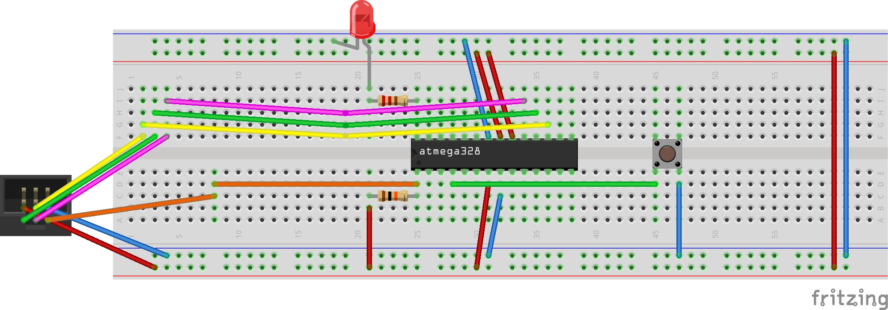

# External interrupts using INTx

The following examples demonstrate how to use a switch on INT0. The goal of the examples is to toggle an LED on each button press. Chaning to another INTx follows the same logic described below. Refer to the cheat sheet for further details.

## Example 1
* Blink LED on each button press
* Bouncing problem 

### Compile and upload
```
avr-gcc -std=c11 -mmcu=atmega328 -O -o example1.o example1.c
avr-objcopy -O ihex example1.o example1.hex
avrdude -c usbasp -p m328p -U flash:w:example1.hex
```
## Example 2
* Blink LED on each button press
* A simple debouncing solution (not the best)

### Compile and upload
```
avr-gcc -std=c11 -mmcu=atmega328 -O -o example2.o example2.c
avr-objcopy -O ihex example2.o example2.hex
avrdude -c usbasp -p m328p -U flash:w:example2.hex
```

### Circuit

